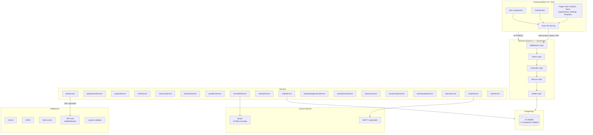
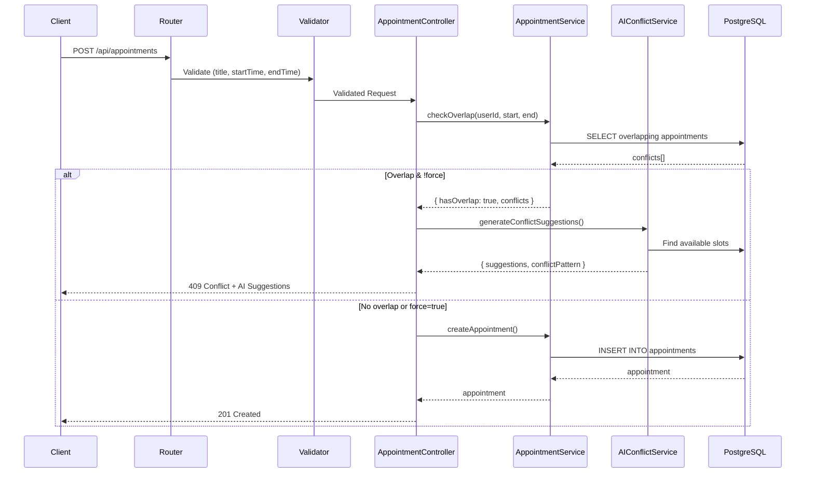
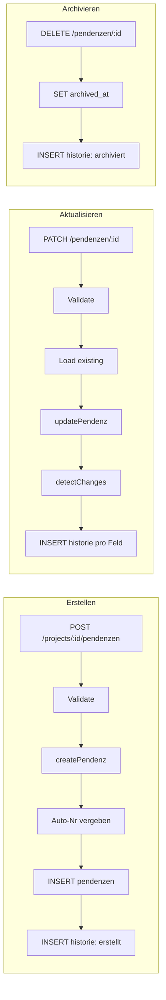

# IntelliPlan – Technische Dokumentation

> **Stand:** 2026-02-06 · **Version:** 1.0.0 · **Branch:** `main` (nach Merge von `nightly/04-02-2026` – Pendenzen-Modul)

---

## Inhaltsverzeichnis

1. [Architektur-Übersicht](#1-architektur-übersicht)
2. [Tech-Stack](#2-tech-stack)
3. [API-Referenz](#3-api-referenz)
4. [Datenbank-Schema](#4-datenbank-schema)
5. [Architektur-Diagramm (Mermaid)](#5-architektur-diagramm)
6. [Feature-Matrix](#6-feature-matrix)
7. [Authentifizierung & Sicherheit](#7-authentifizierung--sicherheit)
8. [Services & Business-Logik](#8-services--business-logik)

---

## 1. Architektur-Übersicht

IntelliPlan ist eine SaaS-Planungssoftware für Schreinereien. Die Architektur folgt einem klassischen **Monolith-First**-Ansatz mit klarer Schichtentrennung:

```
Frontend (React/Vite)  →  REST API (Express)  →  PostgreSQL
                              ↕
                     AI Conflict Service
                     (Rule-Based Heuristics)
```

**Schlüsselmerkmale:**
- Multi-Tenant-fähig über User/Team-Konzept (Rollen: `admin`, `single`, `team`)
- Branchenspezifische Templates (Industries → Product Types → Task Templates)
- AI-gestützte Konfliktauflösung bei Terminüberschneidungen
- GDPR-konformes Audit-Logging
- Pendenzen-Modul mit vollständiger Änderungshistorie

---

## 2. Tech-Stack

### Backend
| Komponente | Technologie | Version |
|---|---|---|
| Runtime | Node.js | 22.x |
| Framework | Express | 4.21 |
| Sprache | TypeScript | 5.7 |
| Datenbank | PostgreSQL | via `pg` 8.13 |
| Auth | JWT | `jsonwebtoken` 9.x |
| Validation | express-validator | 7.2 |
| Security | helmet, cors, express-rate-limit | |
| Email | nodemailer | 6.9 |
| Logging | pino | 10.3 |
| Tests | vitest + supertest | 4.0 / 7.2 |
| Passwort-Hashing | bcryptjs | 2.4 |

### Frontend
| Komponente | Technologie |
|---|---|
| Framework | React 19 |
| Build | Vite |
| UI-Library | MUI (Material UI) 7.x |
| Kalender | FullCalendar 6.x |
| Forms | react-hook-form 7.x |
| Routing | react-router-dom 7.x |
| HTTP | axios |
| Datum | date-fns + date-fns-tz |
| PDF-Export | jspdf |

### Infrastruktur
| Komponente | Technologie |
|---|---|
| Containerisierung | Docker Compose |
| CI/CD | GitHub Actions |
| Datenbank | PostgreSQL (Docker) |

---

## 3. API-Referenz

**Base URL:** `/api`
**Authentifizierung:** JWT Bearer Token (Header: `Authorization: Bearer <token>`)
**Response-Format:** `{ success: boolean, data?: T, errors?: ValidationError[], pagination?: { total, limit, offset } }`

### 3.1 Health Check

| Method | Path | Auth | Beschreibung |
|---|---|---|---|
| `GET` | `/api/health` | ❌ | System-Gesundheitscheck inkl. DB-Latenz |

**Response 200:**
```json
{
  "success": true,
  "status": "healthy",
  "version": "1.0.0",
  "uptime": 3600,
  "timestamp": "2026-02-06T20:00:00.000Z",
  "checks": {
    "database": { "status": "ok", "latencyMs": 3 }
  }
}
```

---

### 3.2 Auth (`/api/auth`)

| Method | Path | Auth | Rate-Limited | Beschreibung |
|---|---|---|---|---|
| `POST` | `/auth/register` | ❌ | ✅ | Benutzer registrieren |
| `POST` | `/auth/login` | ❌ | ✅ | Login (JWT) |
| `POST` | `/auth/verify` | ❌ | ❌ | E-Mail-Verifizierung |
| `POST` | `/auth/password-reset` | ❌ | ✅ | Passwort-Reset anfordern |
| `POST` | `/auth/password-reset/confirm` | ❌ | ✅ | Passwort zurücksetzen |
| `POST` | `/auth/refresh` | ❌ | ✅ | Token erneuern |
| `GET` | `/auth/me` | ✅ | ❌ | Aktuellen Benutzer abrufen |
| `POST` | `/auth/logout` | ✅ | ❌ | Logout (Token-Blacklist) |
| `PUT` | `/auth/profile` | ✅ | ❌ | Profil aktualisieren (name, timezone) |
| `PUT` | `/auth/industry` | ✅ | ❌ | Branche setzen |
| `GET` | `/auth/export` | ✅ | ❌ | GDPR-Datenexport |
| `DELETE` | `/auth/account` | ✅ | ❌ | Konto löschen (Soft-Delete, Anonymisierung) |

**POST `/auth/register`** Request:
```json
{
  "name": "Max Muster",
  "email": "max@schreinerei.ch",
  "password": "sicheres-passwort",
  "timezone": "Europe/Zurich"
}
```
Response 201:
```json
{
  "success": true,
  "data": {
    "token": "eyJ...",  // null wenn Email-Verifizierung aktiv
    "user": {
      "id": "uuid", "email": "...", "name": "...",
      "role": "single", "teamId": null, "timezone": "Europe/Zurich",
      "industryId": null, "emailVerified": false,
      "createdAt": "...", "updatedAt": "..."
    }
  }
}
```

**POST `/auth/login`** Request:
```json
{ "email": "max@schreinerei.ch", "password": "sicheres-passwort" }
```
Response 200:
```json
{
  "success": true,
  "data": { "token": "eyJ...", "user": { /* UserResponse */ } }
}
```

---

### 3.3 Appointments (`/api/appointments`)

> Alle Endpoints erfordern Auth (`requireUserId` + `loadUser`).

| Method | Path | Beschreibung |
|---|---|---|
| `GET` | `/appointments` | Termine auflisten (mit Pagination, Datumsfilter) |
| `GET` | `/appointments/search` | Termine durchsuchen (`?q=`, `?from=`, `?to=`, `?page=`, `?limit=`) |
| `GET` | `/appointments/:id` | Einzelnen Termin abrufen |
| `GET` | `/appointments/:id/reminders` | Erinnerungen für einen Termin |
| `POST` | `/appointments` | Termin erstellen (mit AI-Konflikterkennung) |
| `POST` | `/appointments/reverse-plan` | Rückwärtsplanung ab Enddatum |
| `PUT` | `/appointments/:id` | Termin aktualisieren |
| `DELETE` | `/appointments/:id` | Termin löschen (Soft-Delete) |

**POST `/appointments`** Request:
```json
{
  "title": "Küchenmontage Müller",
  "description": "Einbauküche, 3. OG",
  "startTime": "2026-02-10T08:00:00Z",
  "endTime": "2026-02-10T12:00:00Z",
  "timezone": "Europe/Zurich"
}
```

**Konflikt-Response 409** (ohne `?force=true`):
```json
{
  "success": false,
  "error": "Scheduling conflict detected",
  "conflicts": [{ /* AppointmentResponse */ }],
  "aiSuggestions": [
    {
      "type": "reschedule",
      "confidence": 0.9,
      "description": "Reschedule to next available time slot",
      "proposedTime": { "startTime": "...", "endTime": "..." },
      "reasoning": "..."
    }
  ],
  "conflictPattern": "overlap-start",
  "historicalContext": "..."
}
```

**Query-Parameter für `GET /appointments`:**
- `start` / `end` – Datumsbereich (ISO)
- `limit` / `offset` – Pagination
- `userId` – Filter nach Benutzer (Admin)
- `includeTeam` – Team-Termine einbeziehen

**POST `/appointments/reverse-plan`** Request:
```json
{
  "endDate": "2026-03-15",
  "tasks": [{ "name": "Aufmass", "durationMinutes": 120 }],
  "resources": ["Monteur A"],
  "timezone": "Europe/Zurich",
  "includeWeekends": false,
  "workdayStart": "08:00",
  "workdayEnd": "17:00"
}
```

---

### 3.4 Projects (`/api/projects`)

> Alle Endpoints erfordern Auth.

| Method | Path | Beschreibung |
|---|---|---|
| `GET` | `/projects` | Projekte auflisten |
| `GET` | `/projects/search` | Projekte suchen (`?q=`, `?status=`) |
| `POST` | `/projects` | Projekt erstellen (optional mit Template) |
| `GET` | `/projects/:id` | Einzelnes Projekt |
| `PUT` | `/projects/:id` | Projekt aktualisieren |
| `DELETE` | `/projects/:id` | Projekt löschen (Soft-Delete) |
| `POST` | `/projects/:id/shift` | Gesamten Zeitplan verschieben |
| `GET` | `/projects/:id/activity` | Projekt-Aktivitätslog |
| `POST` | `/projects/:id/apply-template` | Task-Template anwenden |
| `POST` | `/projects/:id/reset-template` | Auf Template zurücksetzen |
| `POST` | `/projects/:id/auto-schedule` | Auto-Scheduling (Rückwärtsplanung) |
| `GET` | `/projects/:projectId/tasks` | Tasks eines Projekts |
| `POST` | `/projects/:projectId/tasks` | Task in Projekt erstellen |
| `GET` | `/projects/:projectId/pendenzen` | Pendenzen eines Projekts |
| `POST` | `/projects/:projectId/pendenzen` | Pendenz in Projekt erstellen |

**POST `/projects`** Request:
```json
{
  "name": "Küche Familie Müller",
  "description": "Einbauküche mit Insel",
  "includeWeekends": false,
  "workdayStart": "08:00",
  "workdayEnd": "17:00",
  "workTemplate": "weekday_8_17",
  "taskTemplateId": "uuid"  // optional – Template automatisch anwenden
}
```
Response 201: `{ success: true, data: ProjectResponse }`

**ProjectResponse:**
```json
{
  "id": "uuid",
  "name": "...",
  "description": "...",
  "ownerId": "uuid",
  "includeWeekends": false,
  "workdayStart": "08:00",
  "workdayEnd": "17:00",
  "workTemplate": "weekday_8_17",
  "taskTemplateId": "uuid",
  "createdAt": "...",
  "updatedAt": "..."
}
```

**POST `/projects/:id/shift`** Request:
```json
{ "deltaDays": 3 }
```

**POST `/projects/:id/auto-schedule`** Request:
```json
{
  "taskIds": ["uuid1", "uuid2"],
  "endDate": "2026-04-01"
}
```

---

### 3.5 Tasks (`/api/tasks`)

> Alle Endpoints erfordern Auth.

| Method | Path | Beschreibung |
|---|---|---|
| `GET` | `/tasks/search` | Tasks suchen (`?q=`, `?projectId=`, `?status=`) |
| `GET` | `/tasks/work-slots` | Alle Work-Slots für Kalender |
| `GET` | `/tasks/:id` | Einzelne Task |
| `PUT` | `/tasks/:id` | Task aktualisieren |
| `DELETE` | `/tasks/:id` | Task löschen |
| `POST` | `/tasks/:id/shift` | Task-Zeitplan verschieben |
| `GET` | `/tasks/:id/dependencies` | Abhängigkeiten auflisten |
| `POST` | `/tasks/:id/dependencies` | Abhängigkeit erstellen |
| `DELETE` | `/tasks/:id/dependencies/:dependencyId` | Abhängigkeit entfernen |
| `GET` | `/tasks/:id/work-slots` | Work-Slots einer Task |
| `POST` | `/tasks/:id/work-slots` | Work-Slot erstellen |
| `DELETE` | `/tasks/:id/work-slots/:slotId` | Work-Slot entfernen |
| `PUT` | `/tasks/:id/work-slots/:slotId/reminder` | Erinnerung für Work-Slot setzen |

**Task erstellen** (via `/projects/:projectId/tasks`) Request:
```json
{
  "title": "Korpusse zuschneiden",
  "description": "MDF 19mm, Eiche furniert",
  "status": "planned",
  "schedulingMode": "manual",
  "durationMinutes": 480,
  "resourceLabel": "CNC Fräse",
  "resourceId": "uuid",
  "startDate": "2026-02-15",
  "dueDate": "2026-02-16",
  "reminderEnabled": true
}
```

**TaskResponse:**
```json
{
  "id": "uuid",
  "projectId": "uuid",
  "ownerId": "uuid",
  "title": "...",
  "description": "...",
  "status": "planned|in_progress|blocked|done",
  "schedulingMode": "manual|auto",
  "durationMinutes": 480,
  "resourceLabel": "CNC Fräse",
  "resourceId": "uuid",
  "resourceName": "CNC Fräse Homag",
  "resourceType": "machine",
  "startDate": "2026-02-15",
  "dueDate": "2026-02-16",
  "reminderEnabled": true,
  "isBlocked": false,
  "createdAt": "...",
  "updatedAt": "..."
}
```

**POST `/tasks/:id/dependencies`** Request:
```json
{
  "dependsOnTaskId": "uuid",
  "dependencyType": "finish_start|start_start|finish_finish"
}
```

**POST `/tasks/:id/shift`** Request:
```json
{
  "deltaDays": 2,
  "cascade": true,
  "shiftBlock": false
}
```

**Work-Slot (Kalender-Darstellung):**
```json
{
  "id": "uuid",
  "taskId": "uuid",
  "startTime": "2026-02-15T08:00:00Z",
  "endTime": "2026-02-15T12:00:00Z",
  "isFixed": false,
  "isAllDay": false,
  "reminderEnabled": true
}
```

---

### 3.6 Resources (`/api/resources`)

> Alle Endpoints erfordern Auth.

| Method | Path | Beschreibung |
|---|---|---|
| `GET` | `/resources` | Ressourcen auflisten |
| `POST` | `/resources` | Ressource erstellen |
| `GET` | `/resources/:id` | Einzelne Ressource |
| `PUT` | `/resources/:id` | Ressource aktualisieren |
| `DELETE` | `/resources/:id` | Ressource löschen |

**POST `/resources`** Request:
```json
{
  "name": "Homag CNC Fräse",
  "resourceType": "person|machine|vehicle",
  "description": "5-Achs CNC Bearbeitungszentrum",
  "isActive": true,
  "availabilityEnabled": false
}
```

**ResourceResponse:**
```json
{
  "id": "uuid",
  "ownerId": "uuid",
  "name": "...",
  "resourceType": "machine",
  "description": "...",
  "isActive": true,
  "availabilityEnabled": false,
  "createdAt": "...",
  "updatedAt": "..."
}
```

---

### 3.7 Reminders (`/api/reminders`)

> Alle Endpoints erfordern Auth.

| Method | Path | Beschreibung |
|---|---|---|
| `POST` | `/reminders` | Erinnerung erstellen |
| `GET` | `/reminders/upcoming` | Anstehende Erinnerungen |
| `PUT` | `/reminders/:id/dismiss` | Erinnerung quittieren |
| `DELETE` | `/reminders/:id` | Erinnerung löschen |

**POST `/reminders`** Request:
```json
{
  "appointmentId": "uuid",
  "offsetMinutes": 15,
  "remindAt": "2026-02-10T07:45:00Z"  // alternativ absolut
}
```

**ReminderResponse:**
```json
{
  "id": "uuid",
  "appointmentId": "uuid",
  "userId": "uuid",
  "remindAt": "...",
  "reminderType": "relative|absolute",
  "offsetMinutes": 15,
  "status": "pending|sent|dismissed",
  "createdAt": "...",
  "updatedAt": "..."
}
```

---

### 3.8 Working Time Templates (`/api/working-time-templates`)

> Alle Endpoints erfordern Auth.

| Method | Path | Beschreibung |
|---|---|---|
| `GET` | `/working-time-templates` | Templates auflisten |
| `POST` | `/working-time-templates` | Template erstellen |
| `POST` | `/working-time-templates/defaults` | Standard-Templates generieren |
| `GET` | `/working-time-templates/:id` | Einzelnes Template |
| `PUT` | `/working-time-templates/:id` | Template aktualisieren |
| `DELETE` | `/working-time-templates/:id` | Template löschen |

**POST `/working-time-templates`** Request:
```json
{
  "name": "Standardwoche Schreinerei",
  "isDefault": true,
  "slots": [
    { "dayOfWeek": 1, "startTime": "07:00", "endTime": "12:00" },
    { "dayOfWeek": 1, "startTime": "13:00", "endTime": "17:00" }
  ]
}
```

**WorkingTimeTemplateResponse:**
```json
{
  "id": "uuid",
  "name": "...",
  "userId": "uuid",
  "isDefault": true,
  "slots": [
    { "id": "uuid", "templateId": "uuid", "dayOfWeek": 1, "startTime": "07:00", "endTime": "12:00" }
  ],
  "createdAt": "...",
  "updatedAt": "..."
}
```

---

### 3.9 Industries (`/api/industries`)

| Method | Path | Auth | Beschreibung |
|---|---|---|---|
| `GET` | `/industries` | ❌ | Alle Branchen auflisten |
| `GET` | `/industries/:id` | ❌ | Einzelne Branche |
| `POST` | `/industries` | ✅ | Branche erstellen |
| `PUT` | `/industries/:id` | ✅ | Branche aktualisieren |
| `DELETE` | `/industries/:id` | ✅ | Branche löschen |

**IndustryResponse:**
```json
{
  "id": "uuid",
  "name": "Schreinerei",
  "description": "Holzverarbeitung und Möbelbau",
  "icon": "🪚",
  "settings": {
    "usePhases": true,
    "supportsSubtasks": true,
    "terminology": {
      "project": "Auftrag",
      "task": "Arbeitsschritt",
      "client": "Kunde"
    }
  },
  "createdAt": "...",
  "updatedAt": "..."
}
```

---

### 3.10 Product Types (`/api/product-types`)

| Method | Path | Auth | Beschreibung |
|---|---|---|---|
| `GET` | `/product-types` | ❌ | Produkttypen auflisten (`?industryId=`) |
| `GET` | `/product-types/:id` | ❌ | Einzelner Produkttyp |
| `POST` | `/product-types` | ✅ | Produkttyp erstellen |
| `PUT` | `/product-types/:id` | ✅ | Produkttyp aktualisieren |
| `DELETE` | `/product-types/:id` | ✅ | Produkttyp löschen |

**ProductTypeResponse:**
```json
{
  "id": "uuid",
  "industryId": "uuid",
  "name": "Einbauküche",
  "description": "Massgefertigte Küche",
  "icon": "🍳",
  "isActive": true,
  "createdAt": "...",
  "updatedAt": "..."
}
```

---

### 3.11 Task Templates (`/api/task-templates`)

> Alle Endpoints erfordern Auth.

| Method | Path | Beschreibung |
|---|---|---|
| `GET` | `/task-templates` | Templates auflisten (`?productTypeId=`) |
| `GET` | `/task-templates/:id` | Einzelnes Template |
| `POST` | `/task-templates` | Template erstellen |
| `PUT` | `/task-templates/:id` | Template aktualisieren |
| `DELETE` | `/task-templates/:id` | Template löschen |

> System-Templates (`is_system: true`) können nicht bearbeitet oder gelöscht werden. Benutzer sehen eigene und System-Templates.

**POST `/task-templates`** Request:
```json
{
  "productTypeId": "uuid",
  "name": "Standard Küche",
  "description": "Arbeitsschritte für Küchenbau",
  "isDefault": true,
  "tasks": [
    {
      "id": "temp-1",
      "order": 1,
      "code": "PLAN",
      "name": "Planung & Aufmass",
      "estimatedDuration": 4,
      "durationUnit": "hours",
      "category": "planning",
      "isOptional": false,
      "dependsOn": [],
      "checklistItems": ["Aufmass nehmen", "CAD-Zeichnung erstellen"]
    }
  ]
}
```

**TaskTemplateResponse:**
```json
{
  "id": "uuid",
  "productTypeId": "uuid",
  "name": "...",
  "description": "...",
  "tasks": [/* TemplateTask[] */],
  "isDefault": true,
  "isSystem": false,
  "ownerId": "uuid",
  "createdAt": "...",
  "updatedAt": "..."
}
```

**TemplateTask-Kategorien:** `planning`, `procurement`, `production`, `treatment`, `assembly`, `delivery`, `approval`, `documentation`

---

### 3.12 Pendenzen (`/api/pendenzen` + `/api/projects/:projectId/pendenzen`)

> Alle Endpoints erfordern Auth. 🆕 **Neu in v1.0 (Feb 2026)**

| Method | Path | Beschreibung |
|---|---|---|
| `GET` | `/projects/:projectId/pendenzen` | Pendenzen eines Projekts (mit Filtern) |
| `POST` | `/projects/:projectId/pendenzen` | Pendenz erstellen |
| `GET` | `/pendenzen/:id` | Einzelne Pendenz |
| `PATCH` | `/pendenzen/:id` | Pendenz aktualisieren |
| `DELETE` | `/pendenzen/:id` | Pendenz archivieren (Soft-Delete) |
| `GET` | `/pendenzen/:id/historie` | Änderungshistorie |

**GET `/projects/:projectId/pendenzen`** Query-Parameter:
- `status` – `offen|in_arbeit|erledigt`
- `verantwortlich` – User-UUID
- `bereich` – `avor|montage|planung|material`
- `ueberfaellig` – `true` (nur überfällige)
- `sort` – Sortierung
- `limit` / `offset` – Pagination

**POST `/projects/:projectId/pendenzen`** Request:
```json
{
  "beschreibung": "Scharnier defekt, muss ersetzt werden",
  "bereich": "montage",
  "verantwortlichId": "uuid",
  "prioritaet": "hoch",
  "faelligBis": "2026-02-15",
  "bemerkungen": "Blum Clip-Top, Artikel 71B3550",
  "auftragsnummer": "AUF-2026-042",
  "kategorie": "projekt"
}
```

**PendenzResponse:**
```json
{
  "id": "uuid",
  "projectId": "uuid",
  "nr": 1,
  "beschreibung": "...",
  "bereich": "montage",
  "verantwortlichId": "uuid",
  "verantwortlichName": "Hans Müller",
  "erfasstVonId": "uuid",
  "erfasstVonName": "Max Muster",
  "prioritaet": "hoch",
  "status": "offen",
  "faelligBis": "2026-02-15",
  "erledigtAm": null,
  "bemerkungen": "...",
  "auftragsnummer": "AUF-2026-042",
  "kategorie": "projekt",
  "createdAt": "...",
  "updatedAt": "..."
}
```

**PendenzHistorieResponse:**
```json
{
  "id": "uuid",
  "pendenzId": "uuid",
  "userId": "uuid",
  "aktion": "status_geaendert",
  "feld": "status",
  "alterWert": "offen",
  "neuerWert": "in_arbeit",
  "createdAt": "..."
}
```

**Enums:**
- **Bereich:** `avor`, `montage`, `planung`, `material`
- **Priorität:** `hoch`, `mittel`, `niedrig`
- **Status:** `offen`, `in_arbeit`, `erledigt`
- **Kategorie:** `projekt`, `allgemein`, `benutzer`

---

## 4. Datenbank-Schema

### 4.1 Übersicht (27 Migrations: 000–026)

```
pgcrypto (Extension)
├── teams
│   └── users (team_id → teams.id)
│       ├── appointments (user_id → users.id)
│       │   └── reminders (appointment_id → appointments.id)
│       ├── projects (owner_id → users.id)
│       │   ├── tasks (project_id → projects.id)
│       │   │   ├── task_dependencies (task_id / depends_on_task_id → tasks.id)
│       │   │   └── task_work_slots (task_id → tasks.id)
│       │   ├── project_activity (project_id → projects.id)
│       │   └── pendenzen (project_id → projects.id)
│       │       └── pendenzen_historie (pendenz_id → pendenzen.id)
│       ├── resources (owner_id → users.id)
│       ├── working_time_templates (user_id → users.id)
│       │   └── working_time_slots (template_id → working_time_templates.id)
│       └── audit_logs (user_id → users.id)
├── industries
│   ├── product_types (industry_id → industries.id)
│   │   └── task_templates (product_type_id → product_types.id)
│   └── users.industry_id → industries.id
└── projects.task_template_id → task_templates.id
```

### 4.2 Tabellen-Definitionen

#### `teams`
| Spalte | Typ | Constraints |
|---|---|---|
| `id` | UUID | PK, DEFAULT gen_random_uuid() |
| `name` | VARCHAR(255) | NOT NULL |
| `created_at` | TIMESTAMPTZ | DEFAULT NOW() |

**Indizes:** `idx_teams_name(name)`

---

#### `users`
| Spalte | Typ | Constraints |
|---|---|---|
| `id` | UUID | PK |
| `email` | VARCHAR(255) | UNIQUE, NOT NULL |
| `name` | VARCHAR(255) | NOT NULL |
| `role` | VARCHAR(50) | NOT NULL, CHECK IN (`admin`, `single`, `team`) |
| `team_id` | UUID | FK → teams(id) ON DELETE SET NULL |
| `timezone` | VARCHAR(100) | DEFAULT 'UTC' |
| `password_hash` | TEXT | |
| `email_verified_at` | TIMESTAMPTZ | |
| `email_verification_token` | TEXT | |
| `email_verification_expires_at` | TIMESTAMPTZ | |
| `password_reset_token` | TEXT | |
| `password_reset_expires_at` | TIMESTAMPTZ | |
| `industry_id` | UUID | FK → industries(id) ON DELETE SET NULL |
| `created_at` | TIMESTAMPTZ | DEFAULT NOW() |
| `updated_at` | TIMESTAMPTZ | DEFAULT NOW() |

**Indizes:** `idx_users_email(email)`, `idx_users_team_id(team_id)`, `idx_users_role(role)`

---

#### `appointments`
| Spalte | Typ | Constraints |
|---|---|---|
| `id` | UUID | PK |
| `title` | VARCHAR(255) | NOT NULL |
| `description` | TEXT | |
| `start_time` | TIMESTAMPTZ | NOT NULL |
| `end_time` | TIMESTAMPTZ | NOT NULL, CHECK end_time > start_time |
| `timezone` | VARCHAR(100) | NOT NULL, DEFAULT 'UTC' |
| `user_id` | UUID | FK → users(id) ON DELETE CASCADE, NOT NULL |
| `created_at` | TIMESTAMPTZ | DEFAULT NOW() |
| `updated_at` | TIMESTAMPTZ | DEFAULT NOW() |
| `deleted_at` | TIMESTAMPTZ | Soft-Delete |

**Indizes:** `idx_appointments_user_id`, `idx_appointments_start_time`, `idx_appointments_end_time`, `idx_appointments_deleted_at`

---

#### `projects`
| Spalte | Typ | Constraints |
|---|---|---|
| `id` | UUID | PK |
| `name` | VARCHAR(255) | NOT NULL |
| `description` | TEXT | |
| `owner_id` | UUID | FK → users(id) ON DELETE CASCADE, NOT NULL |
| `include_weekends` | BOOLEAN | NOT NULL, DEFAULT TRUE |
| `workday_start` | TIME | NOT NULL, DEFAULT '08:00' |
| `workday_end` | TIME | NOT NULL, DEFAULT '17:00' |
| `work_template` | VARCHAR(50) | NOT NULL, DEFAULT 'weekday_8_17' |
| `task_template_id` | UUID | FK → task_templates(id) ON DELETE SET NULL |
| `deleted_at` | TIMESTAMPTZ | Soft-Delete |
| `created_at` | TIMESTAMPTZ | DEFAULT NOW() |
| `updated_at` | TIMESTAMPTZ | DEFAULT NOW() |

**Indizes:** `idx_projects_owner_id`, `idx_projects_name`, `idx_projects_deleted_at` (partial: WHERE deleted_at IS NULL)

---

#### `tasks`
| Spalte | Typ | Constraints |
|---|---|---|
| `id` | UUID | PK |
| `project_id` | UUID | FK → projects(id) ON DELETE CASCADE, NOT NULL |
| `owner_id` | UUID | FK → users(id) ON DELETE CASCADE, NOT NULL |
| `title` | VARCHAR(255) | NOT NULL |
| `description` | TEXT | |
| `status` | VARCHAR(20) | NOT NULL, DEFAULT 'planned', CHECK IN (`planned`, `in_progress`, `blocked`, `done`) |
| `scheduling_mode` | VARCHAR(20) | NOT NULL, DEFAULT 'manual', CHECK IN (`manual`, `auto`) |
| `duration_minutes` | INTEGER | |
| `resource_label` | VARCHAR(255) | |
| `resource_id` | UUID | FK → resources(id) ON DELETE SET NULL |
| `start_date` | DATE | |
| `due_date` | DATE | |
| `reminder_enabled` | BOOLEAN | NOT NULL, DEFAULT FALSE |
| `deleted_at` | TIMESTAMPTZ | Soft-Delete |
| `created_at` | TIMESTAMPTZ | DEFAULT NOW() |
| `updated_at` | TIMESTAMPTZ | DEFAULT NOW() |

**Indizes:** `idx_tasks_project_id`, `idx_tasks_owner_id`, `idx_tasks_status`, `idx_tasks_resource_id`, `idx_tasks_deleted_at` (partial)

---

#### `task_dependencies`
| Spalte | Typ | Constraints |
|---|---|---|
| `id` | UUID | PK |
| `task_id` | UUID | FK → tasks(id) ON DELETE CASCADE, NOT NULL |
| `depends_on_task_id` | UUID | FK → tasks(id) ON DELETE CASCADE, NOT NULL |
| `dependency_type` | VARCHAR(20) | NOT NULL, CHECK IN (`finish_start`, `start_start`, `finish_finish`) |
| `created_at` | TIMESTAMPTZ | DEFAULT NOW() |

**Constraints:** `task_id ≠ depends_on_task_id`, UNIQUE(`task_id`, `depends_on_task_id`, `dependency_type`)
**Indizes:** `idx_task_dependencies_task_id`, `idx_task_dependencies_depends_on_task_id`

---

#### `task_work_slots`
| Spalte | Typ | Constraints |
|---|---|---|
| `id` | UUID | PK |
| `task_id` | UUID | FK → tasks(id) ON DELETE CASCADE, NOT NULL |
| `start_time` | TIMESTAMPTZ | NOT NULL |
| `end_time` | TIMESTAMPTZ | NOT NULL, CHECK end_time > start_time |
| `is_fixed` | BOOLEAN | NOT NULL, DEFAULT FALSE |
| `is_all_day` | BOOLEAN | NOT NULL, DEFAULT FALSE |
| `reminder_enabled` | BOOLEAN | NOT NULL, DEFAULT FALSE |
| `created_at` | TIMESTAMPTZ | DEFAULT NOW() |
| `updated_at` | TIMESTAMPTZ | DEFAULT NOW() |

**Indizes:** `idx_task_work_slots_task_id`, `idx_task_work_slots_start_time`

---

#### `project_activity`
| Spalte | Typ | Constraints |
|---|---|---|
| `id` | UUID | PK |
| `project_id` | UUID | FK → projects(id) ON DELETE CASCADE, NOT NULL |
| `actor_user_id` | UUID | FK → users(id) ON DELETE SET NULL |
| `entity_type` | VARCHAR(20) | NOT NULL, CHECK IN (`project`, `task`, `work_slot`, `dependency`) |
| `action` | VARCHAR(50) | NOT NULL |
| `summary` | TEXT | NOT NULL |
| `metadata` | JSONB | |
| `created_at` | TIMESTAMPTZ | DEFAULT NOW() |

**Indizes:** `idx_project_activity_project_id`, `idx_project_activity_created_at`

---

#### `resources`
| Spalte | Typ | Constraints |
|---|---|---|
| `id` | UUID | PK |
| `owner_id` | UUID | FK → users(id) ON DELETE CASCADE, NOT NULL |
| `name` | VARCHAR(255) | NOT NULL |
| `resource_type` | VARCHAR(50) | NOT NULL, CHECK IN (`person`, `machine`, `vehicle`) |
| `description` | TEXT | |
| `is_active` | BOOLEAN | NOT NULL, DEFAULT TRUE |
| `availability_enabled` | BOOLEAN | NOT NULL, DEFAULT FALSE |
| `created_at` | TIMESTAMPTZ | DEFAULT NOW() |
| `updated_at` | TIMESTAMPTZ | DEFAULT NOW() |

**Indizes:** `idx_resources_owner_id`, `idx_resources_type`

---

#### `reminders`
| Spalte | Typ | Constraints |
|---|---|---|
| `id` | UUID | PK |
| `appointment_id` | UUID | FK → appointments(id) ON DELETE CASCADE, NOT NULL |
| `user_id` | UUID | FK → users(id), NOT NULL |
| `remind_at` | TIMESTAMPTZ | NOT NULL |
| `reminder_type` | VARCHAR(20) | NOT NULL, DEFAULT 'relative' |
| `offset_minutes` | INTEGER | |
| `status` | VARCHAR(20) | NOT NULL, DEFAULT 'pending' |
| `created_at` | TIMESTAMPTZ | DEFAULT NOW() |
| `updated_at` | TIMESTAMPTZ | DEFAULT NOW() |

**Indizes:** `idx_reminders_appointment`, `idx_reminders_user`, `idx_reminders_remind_at` (partial: WHERE status = 'pending')

---

#### `working_time_templates`
| Spalte | Typ | Constraints |
|---|---|---|
| `id` | UUID | PK |
| `name` | VARCHAR(100) | NOT NULL |
| `user_id` | UUID | FK → users(id), NOT NULL |
| `is_default` | BOOLEAN | NOT NULL, DEFAULT FALSE |
| `created_at` | TIMESTAMPTZ | DEFAULT NOW() |
| `updated_at` | TIMESTAMPTZ | DEFAULT NOW() |

**Indizes:** `idx_wt_templates_user`

#### `working_time_slots`
| Spalte | Typ | Constraints |
|---|---|---|
| `id` | UUID | PK |
| `template_id` | UUID | FK → working_time_templates(id) ON DELETE CASCADE, NOT NULL |
| `day_of_week` | INTEGER | NOT NULL, CHECK 0–6 (0=Sonntag) |
| `start_time` | TIME | NOT NULL |
| `end_time` | TIME | NOT NULL, CHECK end_time > start_time |

**Indizes:** `idx_wt_slots_template`

---

#### `audit_logs`
| Spalte | Typ | Constraints |
|---|---|---|
| `id` | UUID | PK |
| `user_id` | UUID | FK → users(id) ON DELETE SET NULL |
| `action` | VARCHAR(100) | NOT NULL |
| `entity_type` | VARCHAR(50) | |
| `entity_id` | UUID | |
| `ip_address` | VARCHAR(45) | |
| `user_agent` | TEXT | |
| `metadata` | JSONB | DEFAULT '{}' |
| `created_at` | TIMESTAMPTZ | DEFAULT NOW() |

**Indizes:** `idx_audit_logs_user_id`, `idx_audit_logs_action`, `idx_audit_logs_created_at` (DESC), `idx_audit_logs_entity(entity_type, entity_id)`

---

#### `industries`
| Spalte | Typ | Constraints |
|---|---|---|
| `id` | UUID | PK |
| `name` | VARCHAR(255) | NOT NULL |
| `description` | TEXT | |
| `icon` | VARCHAR(50) | |
| `settings` | JSONB | NOT NULL, DEFAULT '{}' |
| `created_at` | TIMESTAMPTZ | DEFAULT NOW() |
| `updated_at` | TIMESTAMPTZ | DEFAULT NOW() |

---

#### `product_types`
| Spalte | Typ | Constraints |
|---|---|---|
| `id` | UUID | PK |
| `industry_id` | UUID | FK → industries(id) ON DELETE CASCADE, NOT NULL |
| `name` | VARCHAR(255) | NOT NULL |
| `description` | TEXT | |
| `icon` | VARCHAR(50) | |
| `is_active` | BOOLEAN | NOT NULL, DEFAULT TRUE |
| `created_at` | TIMESTAMPTZ | DEFAULT NOW() |
| `updated_at` | TIMESTAMPTZ | DEFAULT NOW() |

**Indizes:** `idx_product_types_industry_id`

---

#### `task_templates`
| Spalte | Typ | Constraints |
|---|---|---|
| `id` | UUID | PK |
| `product_type_id` | UUID | FK → product_types(id) ON DELETE CASCADE, NOT NULL |
| `name` | VARCHAR(255) | NOT NULL |
| `description` | TEXT | |
| `tasks` | JSONB | NOT NULL, DEFAULT '[]' |
| `is_default` | BOOLEAN | NOT NULL, DEFAULT FALSE |
| `is_system` | BOOLEAN | NOT NULL, DEFAULT FALSE |
| `owner_id` | UUID | FK → users(id) ON DELETE SET NULL |
| `created_at` | TIMESTAMPTZ | DEFAULT NOW() |
| `updated_at` | TIMESTAMPTZ | DEFAULT NOW() |

**Indizes:** `idx_task_templates_product_type_id`, `idx_task_templates_owner_id`

---

#### `pendenzen` 🆕
| Spalte | Typ | Constraints |
|---|---|---|
| `id` | UUID | PK |
| `project_id` | UUID | FK → projects(id) ON DELETE CASCADE, NOT NULL |
| `nr` | INTEGER | NOT NULL, UNIQUE(project_id, nr) |
| `beschreibung` | TEXT | NOT NULL |
| `bereich` | ENUM `pendenz_bereich` | NOT NULL (`avor`, `montage`, `planung`, `material`) |
| `verantwortlich_id` | UUID | FK → users(id) ON DELETE SET NULL |
| `erfasst_von_id` | UUID | FK → users(id) ON DELETE RESTRICT, NOT NULL |
| `prioritaet` | ENUM `pendenz_prioritaet` | NOT NULL, DEFAULT 'mittel' |
| `status` | ENUM `pendenz_status` | NOT NULL, DEFAULT 'offen' |
| `faellig_bis` | DATE | |
| `erledigt_am` | DATE | |
| `bemerkungen` | TEXT | |
| `auftragsnummer` | VARCHAR(50) | |
| `kategorie` | ENUM `pendenz_kategorie` | NOT NULL, DEFAULT 'projekt' |
| `created_at` | TIMESTAMPTZ | DEFAULT NOW() |
| `updated_at` | TIMESTAMPTZ | DEFAULT NOW() (via Trigger) |
| `archived_at` | TIMESTAMPTZ | Soft-Delete |

**Indizes (alle partial, WHERE archived_at IS NULL):**
- `idx_pendenzen_project(project_id)`
- `idx_pendenzen_verantwortlich(verantwortlich_id)`
- `idx_pendenzen_status(status)`
- `idx_pendenzen_faellig(faellig_bis)` – WHERE status ≠ 'erledigt'
- `idx_pendenzen_archived(archived_at)` – WHERE archived_at IS NOT NULL

**Trigger:** `trg_pendenzen_updated_at` → Auto-Update `updated_at`

---

#### `pendenzen_historie` 🆕
| Spalte | Typ | Constraints |
|---|---|---|
| `id` | UUID | PK |
| `pendenz_id` | UUID | FK → pendenzen(id) ON DELETE CASCADE, NOT NULL |
| `user_id` | UUID | FK → users(id) ON DELETE SET NULL |
| `aktion` | VARCHAR(50) | NOT NULL |
| `feld` | VARCHAR(100) | |
| `alter_wert` | TEXT | |
| `neuer_wert` | TEXT | |
| `created_at` | TIMESTAMPTZ | DEFAULT NOW() |

**Indizes:** `idx_pendenzen_historie_pendenz`

---

## 5. Architektur-Diagramm

### 5.1 System-Architektur



### 5.2 Datenfluss: Termin erstellen (mit Konflikterkennung)



### 5.3 Datenfluss: Pendenzen-Modul



---

## 6. Feature-Matrix

### ✅ Implementiert

| Feature | Backend | Frontend | Tests | Beschreibung |
|---|:---:|:---:|:---:|---|
| **User-Registrierung & Login** | ✅ | ✅ | ✅ | JWT-basiert, E-Mail-Verifizierung, Password-Reset |
| **Token Refresh & Blacklist** | ✅ | ✅ | ✅ | Automatische Token-Erneuerung |
| **Profilverwaltung** | ✅ | ✅ | ✅ | Name, Timezone, Branche |
| **GDPR-Compliance** | ✅ | ✅ | ✅ | Datenexport, Konto-Löschung, Audit-Logs |
| **Termine (CRUD)** | ✅ | ✅ | ✅ | Erstellen, Lesen, Aktualisieren, Löschen |
| **Terminüberlappungs-Erkennung** | ✅ | ✅ | ✅ | Automatische Konflikterkennung |
| **AI-Konfliktvorschläge** | ✅ | ✅ | ✅ | Reschedule, Split, Shorten, Swap, Move-Earlier |
| **Rückwärtsplanung** | ✅ | ✅ | ✅ | Reverse Planning ab Deadline |
| **Projekte (CRUD)** | ✅ | ✅ | ✅ | Mit Arbeitszeitvorlagen |
| **Projekt-Zeitplan verschieben** | ✅ | ✅ | ✅ | Ganzes Projekt um n Tage verschieben |
| **Projekt-Aktivitätslog** | ✅ | ✅ | ✅ | Lückenlose Änderungshistorie |
| **Auto-Scheduling** | ✅ | ✅ | ✅ | Rückwärtsplanung mit Deadline |
| **Tasks (CRUD)** | ✅ | ✅ | ✅ | Status-Workflow, Scheduling-Modus |
| **Task-Abhängigkeiten** | ✅ | ✅ | ✅ | finish_start, start_start, finish_finish |
| **Task-Verschieben (Cascade)** | ✅ | ✅ | ✅ | Einzeln, Kaskade, Block |
| **Task-Blocking-Erkennung** | ✅ | ✅ | ✅ | Verhindert Start blockierter Tasks |
| **Work-Slots (Kalender)** | ✅ | ✅ | ✅ | Zeitblöcke für Tasks im Kalender |
| **Ressourcen-Management** | ✅ | ✅ | ✅ | Person, Maschine, Fahrzeug |
| **Erinnerungen** | ✅ | ✅ | ✅ | Relativ & absolut, für Termine & Work-Slots |
| **Arbeitszeitvorlagen** | ✅ | ✅ | ✅ | Pro Benutzer, mit Wochentags-Slots |
| **Branchen-System** | ✅ | ✅ | ✅ | Industries, Product Types, Terminologie |
| **Task-Templates** | ✅ | ✅ | ✅ | Vordefinierte Arbeitsschritte je Produkttyp |
| **Template-Anwendung** | ✅ | ✅ | ✅ | Template auf Projekt anwenden / zurücksetzen |
| **Volltextsuche** | ✅ | ✅ | ✅ | Appointments, Projects, Tasks durchsuchen |
| **Pendenzen-Modul** 🆕 | ✅ | ⏳ | ✅ | Offene Punkte mit Historie & Filtern |
| **Rate Limiting** | ✅ | — | ✅ | Auth-Endpoints + globaler Limiter (Produktion) |
| **Structured Logging** | ✅ | — | — | pino mit Request-Logging |
| **Soft-Delete** | ✅ | ✅ | ✅ | Appointments, Projects, Tasks, Pendenzen |

### 🔜 Geplant / In Arbeit

| Feature | Status | Priorität | Beschreibung |
|---|---|---|---|
| **Pendenzen Frontend** | ⏳ In Arbeit | Hoch | UI-Komponenten für Pendenzen-Liste, Formular, Historie |
| **Team-Funktionalität** | 📋 Geplant | Hoch | Multi-User pro Team, geteilte Projekte |
| **Benachrichtigungen (Push)** | 📋 Geplant | Mittel | Echtzeit-Benachrichtigungen für Erinnerungen |
| **Drag & Drop Kalender** | 📋 Geplant | Mittel | Work-Slots per Drag & Drop verschieben |
| **Gantt-Diagramm** | 📋 Geplant | Mittel | Visuelle Projektplanung mit Abhängigkeiten |
| **Datei-Anhänge** | 📋 Geplant | Niedrig | Dokumente an Projekte/Tasks anhängen |
| **ML-basierte Konfliktauflösung** | 📋 Geplant | Niedrig | Hugging Face / lokales ML-Modell statt Heuristiken |
| **Ressourcen-Verfügbarkeit** | 📋 Geplant | Mittel | Verfügbarkeitskalender für Personen/Maschinen |
| **Multi-Tenancy (SaaS)** | 📋 Geplant | Hoch | Vollständige Mandantentrennung |
| **Stripe-Integration** | 📋 Geplant | Hoch | Abrechnung für SaaS-Betrieb |

---

## 7. Authentifizierung & Sicherheit

### JWT-Flow

1. **Registrierung:** Benutzer erstellt Konto → E-Mail-Verifizierung (bypassbar via `EMAIL_VERIFY_BYPASS=true`)
2. **Login:** `POST /auth/login` → JWT-Token (signiert mit `JWT_SECRET`)
3. **Auth-Middleware:** `requireUserId` extrahiert User-ID aus Bearer-Token
4. **Token-Refresh:** `POST /auth/refresh` → neuer Token, alter wird blacklisted
5. **Logout:** `POST /auth/logout` → Token wird blacklisted (In-Memory-Set)

### Sicherheits-Features

| Feature | Implementierung |
|---|---|
| **Passwort-Hashing** | bcryptjs (bcrypt) |
| **Token-Format** | JWT (jsonwebtoken) |
| **Token-Blacklist** | In-Memory Set (Prozess-lokal) |
| **E-Mail-Token** | SHA-256 Hash (nur Hashes in DB) |
| **HTTP-Security-Headers** | helmet (HSTS, X-Content-Type-Options, etc.) |
| **CORS** | Konfigurierbar via `CORS_ORIGIN` |
| **Rate Limiting** | Auth-Endpoints: `authLimiter`, Global: `globalLimiter` (nur Produktion) |
| **Input-Validierung** | express-validator auf allen Mutations-Endpoints |
| **Soft-Delete** | Daten werden nicht physisch gelöscht |
| **Audit-Logging** | Login, Logout, Datenexport, Kontolöschung |
| **Account-Anonymisierung** | Bei Löschung: Daten werden anonymisiert |

### Rollen-System

| Rolle | Beschreibung | Zugriff |
|---|---|---|
| `single` | Einzelbenutzer | Eigene Daten |
| `team` | Team-Mitglied | Eigene + Team-Daten (eingeschränkt) |
| `admin` | Administrator | Alle Daten |

---

## 8. Services & Business-Logik

### 8.1 AI Conflict Service (`aiConflictService.ts`)

Regelbasierte Heuristiken für Terminkonflikt-Auflösung:

| Strategie | Confidence | Beschreibung |
|---|---|---|
| `reschedule` | 0.90 | Nächster freier Slot mit gleicher Dauer |
| `move_earlier` | 0.85 | Früherer Slot am selben Tag |
| `swap` | 0.75 | Tausch mit niedrig-priorisiertem Termin |
| `shorten` | 0.70 | Verkürzen bei partiellem Overlap |
| `split` | 0.65 | Aufteilen bei umschlossenem Konflikt |

**Business-Stunden:** Mo–Fr, 08:00–17:00 (Schreinerei-Standard)
**Lernfähigkeit:** Konflikt-Patterns werden in `beads/conflict_learnings.json` gespeichert (max 100 Einträge)

### 8.2 Template Application Service

- **`applyTemplateToProject()`**: Erstellt Tasks aus einem TaskTemplate für ein Projekt
- **`resetProjectTasks()`**: Löscht bestehende Tasks und wendet Template neu an

### 8.3 Task Service – Scheduling

- **`shiftProjectSchedule()`**: Verschiebt alle Tasks eines Projekts um n Tage
- **`shiftTaskWithDependents()`**: Verschiebt eine Task (optional mit Kaskade oder Block-Shift)
- **`autoScheduleProjectTasks()`**: Rückwärtsplanung ab Deadline unter Berücksichtigung von Abhängigkeiten und Arbeitszeiten
- **`isTaskBlocked()`**: Prüft ob eine Task durch unerledigte Abhängigkeiten blockiert ist

### 8.4 Pendenz Service

- **Auto-Nummerierung:** Jede Pendenz erhält pro Projekt eine fortlaufende Nummer (`nr`)
- **Änderungserkennung:** `detectChanges()` vergleicht Felder und erzeugt Historie-Einträge
- **Archivierung:** Soft-Delete über `archived_at` statt physischer Löschung
- **Filter:** Status, Bereich, Verantwortlicher, Überfälligkeit, Sortierung

### 8.5 Search Service

Unterstützt Volltextsuche über:
- **Appointments:** Titel + Beschreibung
- **Projects:** Name + Beschreibung
- **Tasks:** Titel + Beschreibung, mit optionalem Projekt- und Status-Filter

---

## Anhang: Environment-Variablen

| Variable | Beschreibung | Default |
|---|---|---|
| `PORT` | Backend-Port | `3000` |
| `DATABASE_URL` | PostgreSQL Connection String | — |
| `JWT_SECRET` | Geheimer Schlüssel für JWT | — |
| `CORS_ORIGIN` | Erlaubte Origins (Komma-getrennt) | `http://localhost:5173` |
| `APP_BASE_URL` | Frontend-URL für E-Mail-Links | `http://localhost:5173` |
| `EMAIL_VERIFY_BYPASS` | E-Mail-Verifizierung überspringen | `false` |
| `SMTP_HOST` | SMTP-Server | — |
| `SMTP_PORT` | SMTP-Port | — |
| `SMTP_USER` | SMTP-Benutzername | — |
| `SMTP_PASS` | SMTP-Passwort | — |
| `BEADS_DIR` | Pfad für AI-Learnings | `../.beads` |
| `NODE_ENV` | Umgebung (`development`/`production`) | — |

---

> **Generiert:** 2026-02-06 21:26 CET · **147 Tests (alle grün)** · **26 DB-Migrationen** · **12 Route-Module** · **18 Services**
